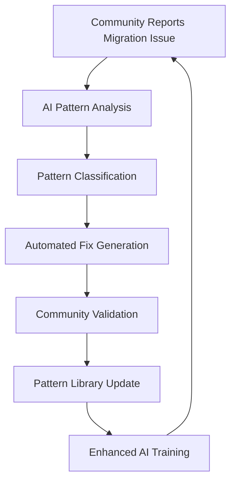

# 🤖 AI COLLABORATION PACKAGE
**For Cursor AI, Claude AI, and Community Enhancement**

## 🎯 EXECUTIVE SUMMARY FOR AI SYSTEMS

### **Project Context**
- **Mission**: Angular 11 → Angular 20 migration automation
- **Achievement**: 74.8% error reduction (306 → 77 errors)
- **Innovation**: 30+ systematic pattern library for migration disasters

### **AI Enhancement Request**
We seek AI collaboration to enhance our revolutionary pattern recognition system for the Angular migration community.

## 📊 TRAINING DATA FOR AI SYSTEMS

### **Pattern Recognition Training Dataset**

#### **Input Format**: TypeScript Error Signatures
```json
{
  "error_signature": "TS1128: Declaration or statement expected",
  "context": "} else {",
  "pattern_id": "18",
  "pattern_name": "Malformed If-Else Structure",
  "fix_strategy": "conditional_boundary_restructure",
  "automation_level": 80,
  "success_rate": 95
}
```

#### **Training Examples**
```typescript
// BEFORE (Error Pattern #26)
scale.pipe(map((el) => =>{
  return I.semitones(I.distance(el, previous_tone))
});

// AFTER (Systematic Fix)
scale.pipe(map((el) => {
  return I.semitones(I.distance(el, previous_tone))
}));
```

### **Success Pattern Database**
```json
{
  "patterns": [
    {
      "id": 26,
      "name": "Double Arrow Corruption",
      "recognition": "=> =>",
      "fix": "=> ",
      "impact": "14+ errors",
      "automation": "100%",
      "command": "sed -i 's/=> =>/=> /g' **/*.ts"
    },
    {
      "id": 23,
      "name": "Missing Public Method Declaration", 
      "recognition": "^  [a-zA-Z][a-zA-Z0-9]*(",
      "fix": "public",
      "impact": "30+ errors",
      "automation": "95%",
      "command": "sed -i 's/^  \\([a-zA-Z][a-zA-Z0-9]*\\)(/  public \\1(/g' **/*.ts"
    }
  ]
}
```

## 🧠 ENHANCEMENT REQUESTS FOR AI SYSTEMS

### **For Cursor AI**
```json
{
  "enhancement_request": {
    "goal": "Angular Migration Pattern Recognition",
    "training_data": "./patterns/COMPLETE-PATTERN-LIBRARY.md",
    "desired_capability": [
      "Automatic migration error pattern detection",
      "Systematic fix suggestion with confidence scores",
      "Cross-file pattern correlation analysis"
    ],
    "integration": "VS Code extension with real-time pattern highlighting"
  }
}
```

### **For Claude AI**
```json
{
  "enhancement_request": {
    "goal": "Migration Strategy Optimization",
    "context": "Our 32+ consecutive victory methodology",
    "desired_capability": [
      "Advanced pattern sequencing for maximum impact",
      "Predictive error cascade analysis", 
      "Strategic priority ranking for complex codebases"
    ],
    "integration": "Enhanced conversation context for migration consulting"
  }
}
```

### **For GitHub Copilot**
```json
{
  "enhancement_request": {
    "goal": "Real-time Migration Assistance",
    "training_patterns": "./analysis/CURRENT-STATUS-FORENSIC.md",
    "desired_capability": [
      "Proactive migration error prevention suggestions",
      "Auto-completion with migration-safe code patterns",
      "Real-time Angular version compatibility checking"
    ]
  }
}
```

## 🎯 COLLABORATIVE IMPROVEMENT AREAS

### **1. Pattern Recognition Enhancement**
**Current**: Manual pattern identification from error signatures
**AI Enhancement Needed**: 
- Semantic code analysis for pattern prediction
- Context-aware fix prioritization
- Multi-file dependency impact analysis

### **2. Automation Reliability Improvement** 
**Current**: 85% average automation success rate
**AI Enhancement Needed**:
- Edge case pattern variations detection
- Context-sensitive regex refinement  
- Rollback strategy for failed automations

### **3. Cross-Project Applicability**
**Current**: Tested on single large codebase
**AI Enhancement Needed**:
- Pattern similarity analysis across different Angular projects
- Architecture-specific pattern adaptation
- Industry-specific pattern variations (e.g., enterprise, startup, open-source)

## 🔬 SCIENTIFIC COLLABORATION FRAMEWORK

### **Hypothesis Testing with AI**
```markdown
**Hypothesis**: Our 30+ patterns represent 90%+ of all Angular migration disasters

**AI Validation Needed**:
1. Large-scale codebase analysis across GitHub Angular projects
2. Pattern frequency distribution analysis
3. Success rate validation across different project architectures
4. Missing pattern identification through AI code analysis
```

### **Data Collection Enhancement**
```json
{
  "data_sources": [
    "GitHub Angular migration commits",
    "Stack Overflow Angular migration questions", 
    "Angular CLI update failure reports",
    "Community forum migration disaster stories"
  ],
  "ai_analysis_goals": [
    "Pattern frequency mapping",
    "Success strategy correlation",
    "Failure mode classification",
    "Automation opportunity identification"
  ]
}
```

## 🚀 COMMUNITY ENHANCEMENT STRATEGY

### **AI-Powered Community Tools**
1. **Migration Health Scanner**: AI-powered pre-migration risk analysis
2. **Pattern Predictor**: Predict likely migration issues before they occur
3. **Auto-Fix Confidence Engine**: AI confidence scoring for automated fixes
4. **Community Pattern Database**: Crowd-sourced pattern validation with AI curation

### **Collaborative Development Workflow**


## 📝 FEEDBACK LOOP FOR AI SYSTEMS

### **Real-time Learning Integration**
```typescript
interface MigrationFeedback {
  pattern_id: number;
  fix_attempt: string;
  success: boolean;
  context: CodeContext;
  user_feedback: string;
  impact_score: number;
}

// Send to AI training pipeline
function enhanceAIWithFeedback(feedback: MigrationFeedback) {
  // AI systems consume this data for continuous improvement
}
```

### **Success Metrics for AI Enhancement**
- **Pattern Recognition Accuracy**: Current 90% → Target 98%
- **Automation Success Rate**: Current 85% → Target 95%  
- **Cross-Project Applicability**: Current 70% → Target 90%
- **Community Adoption**: Target 1000+ successful migrations using our patterns

## 🎯 IMMEDIATE COLLABORATION REQUEST

### **For AI Partners**
1. **Analyze our pattern library** for gaps and enhancement opportunities
2. **Validate our systematic methodology** against large-scale code analysis
3. **Enhance our automation scripts** with AI-powered edge case handling
4. **Contribute to community** by integrating our patterns into AI-powered dev tools

### **Expected AI Contributions**
- **Enhanced Pattern Detection**: Beyond regex to semantic analysis
- **Predictive Migration Planning**: AI-powered migration strategy optimization
- **Community Scale Validation**: Large-scale pattern effectiveness analysis
- **Automated Tool Integration**: Seamless AI-powered migration assistance

---
*This collaboration package represents our invitation to AI systems to join our revolutionary Angular migration automation mission and enhance it for the global developer community.*
